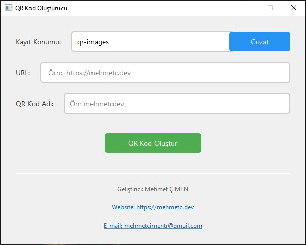

# QR Kod Oluşturucu / QR Code Generator

[English](#english) | [Türkçe](#türkçe)



## Türkçe

### 📝 Proje Hakkında
QR Kod Oluşturucu, web sitesi URL'lerini kolayca QR kodlarına dönüştüren basit ve kullanıcı dostu bir masaüstü uygulamasıdır. PyQt6 ile geliştirilmiş modern bir arayüze sahiptir.

### ✨ Özellikler
- Kullanıcı dostu grafiksel arayüz
- Özelleştirilebilir QR kod kayıt konumu
- Otomatik PNG formatında kaydetme
- URL doğrulama
- Modern ve temiz tasarım

### 🛠 Gereksinimler
- Python 3.6+
- PyQt6
- qrcode
- Pillow

### ⚙️ Kurulum
1. Repoyu klonlayın:
```bash
git clone https://github.com/mehmetcimen/qr-generator.git
```

2. Gerekli kütüphaneleri yükleyin:
```bash
pip install -r requirements.txt
```

3. Uygulamayı çalıştırın:
```bash
python qr_generator.py
```

### 📦 Executable Oluşturma
```bash
pyinstaller --name="QR Generator" --windowed --onefile qr_generator.py
```

### 💡 Kullanım
1. Kayıt konumunu seçin (varsayılan: qr-images)
2. URL'yi girin
3. QR kod için bir isim belirleyin
4. "QR Kod Oluştur" butonuna tıklayın


### 📄 Lisans
Bu proje MIT lisansı altında lisanslanmıştır. Detaylar için [LICENSE](LICENSE) dosyasına bakınız.

---

## English

### 📝 About The Project
QR Code Generator is a simple and user-friendly desktop application that converts website URLs into QR codes. It features a modern interface developed with PyQt6.

### ✨ Features
- User-friendly graphical interface
- Customizable QR code save location
- Automatic PNG format saving
- URL validation
- Modern and clean design

### 🛠 Requirements
- Python 3.6+
- PyQt6
- qrcode
- Pillow

### ⚙️ Installation
1. Clone the repository:
```bash
git clone https://github.com/mehmetcimen/qr-generator.git
```

2. Install required packages:
```bash
pip install -r requirements.txt
```

3. Run the application:
```bash
python qr_generator.py
```

### 📦 Creating Executable
```bash
pyinstaller --name="QR Generator" --windowed --onefile qr_generator.py
```

### 💡 Usage
1. Select save location (default: qr-images)
2. Enter URL
3. Set a name for the QR code
4. Click "Generate QR Code" button


### 📄 License
This project is licensed under the MIT License - see the [LICENSE](LICENSE) file for details.

---

### 👨‍💻 Geliştirici / Developer
- Website: [https://mehmetc.dev](https://mehmetc.dev)
- Email: mehmetcimentr@gmail.com
